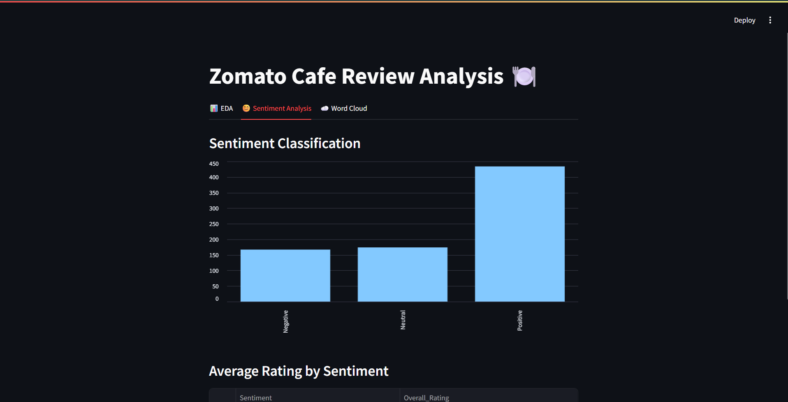
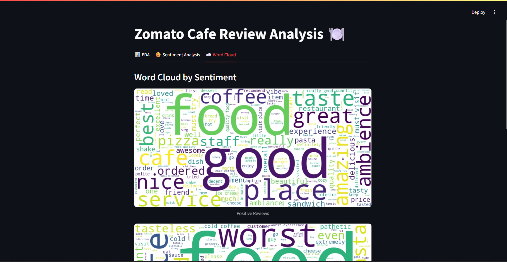

# 🍽️ Zomato Cafe Review Analysis

A data science and NLP project to analyze customer reviews from Zomato cafe listings, classify sentiment, and extract key insights from textual data.


## 🚀 Project Overview

This project leverages real-world customer reviews from Zomato to uncover patterns in customer satisfaction. Using Python, NLP, and visualization tools, it performs sentiment analysis, exploratory data analysis (EDA), and generates word clouds for intuitive insights.


## 🧠 Objectives

- Load and preprocess Zomato review data.
- Perform EDA on ratings, cities, and cuisines.
- Apply NLP for text cleaning and lemmatization.
- Conduct sentiment analysis using TextBlob.
- Visualize review content using word clouds.
- Create an interactive multi-tab Streamlit dashboard.


## 🗂️ Dataset

- **Source**: [Kaggle - Zomato Cafe Reviews](https://www.kaggle.com/datasets/juhibhojani/zomato-cafe-reviews)
- **Columns**:
  - `Name`: Restaurant name
  - `Overall_Rating`: Customer rating (0–5)
  - `Cuisine`: Types of food
  - `Rate for two`: Price for two
  - `City`: City where the cafe is located
  - `Review`: Textual review by customer


## 🛠️ Tech Stack

- **Python**
- **Pandas**, **NumPy**, **Seaborn**, **Matplotlib**
- **NLTK**, **TextBlob**, **WordCloud**
- **Streamlit** – for dashboard UI


## 📊 Dashboard Features

➡️ **Multi-tab layout** with:
- **📊 EDA Tab**: Rating distributions, top cities, cuisine visualizations  
- **😊 Sentiment Tab**: Sentiment breakdown using TextBlob  
- **☁️ Word Cloud Tab**: Word clouds by sentiment category  


## 📷 Screenshots

> 📌 
> 📌 

## ▶️ How to Run Locally

1. **Clone the repo**  
```bash
git clone https://github.com/Shre1100/Zomato-Cafe-Review-Analysis.git
cd zomato-cafe-review-analysis
```
2. **(Optional) Create and activate a virtual environment**
```bash
python -m venv venv
# On Windows:
venv\Scripts\activate
# On macOS/Linux:
source venv/bin/activate
```
3. **Install all dependencies**
```bash
pip install -r requirements.txt
```
4. **Run the Streamlit app**
```bash
streamlit run app.py
```

This will open the dashboard in your browser at http://localhost:8501